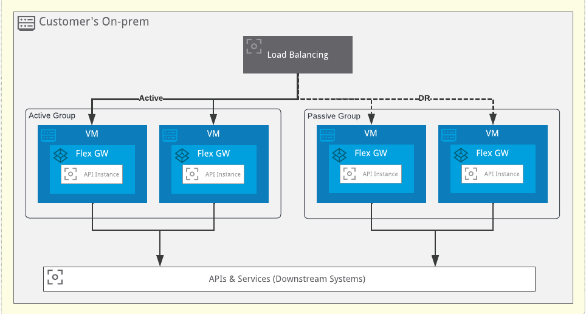
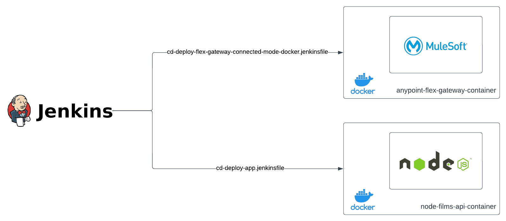

# Docker Container Connected Mode

These examples show how a Continuous Delivery solution can be implemented for an [Anypoint Flex Gateway](https://docs.mulesoft.com/gateway/flex-gateway-getting-started) instance installed as a Docker container, in connected mode. In this mode, Flex Gateway is connected with the Anypoint control plane and its managed via Anypoint Platform Web User Interface or its Platform APIs.

There are 2 presented examples:
1. The first example covers how to automate the installation, registration and start of the Flex Gateway as a Docker container via a Jenkins pipeline described by the Jenkinsfile found at `docker-container-connected-mode/jenkins/cd-deploy-flex-gateway-connected-mode-docker.jenkinsfile` within this repository.
2. The second example demonstrates how to programmatically manage the Flex Gateway via HTTPs requests to Anypoint Platform APIs. These requests are part of a Postman collection that gets executed by Newman CLI in a Jenkins pipeline described by the Jenkinsfile found at `docker-container-connected-mode/jenkins/cd-deploy-app.jenkinsfile` within this repository. With these we cover the registration of a sample API as an API instance to be managed via the Flex Gateway and how to apply [Basic Authentication Policy](https://docs.mulesoft.com/api-manager/2.x/basic-authentication-simple-concept) to that API instance before deploying it as a Docker container.

Both examples use a [Connected App](https://docs.mulesoft.com/access-management/connected-apps-overview) to interact with Anypoint Platform APIs.

**Note: The steps below are correct at time of writing, based on a beta version of Flex Gateway. Please refer to the Flex Gateway documentation for up-to-date instructions on installing and configuring Flex Gateway.**

## Pre-requisites

1. A valid version of [Jenkins](https://www.jenkins.io/) is installed and ready to be used.
2. A valid version of [Docker](https://www.docker.com/) is installed and configured to be used by Jenkins.
3. A valid version of [Node.js](https://nodejs.org/en/) is installed and configured to be used by Jenkins.

## Prepare the Connected App

1. In Anypoint Platform, [configure a Connected App](https://docs.mulesoft.com/service-mesh/1.2/obtain-connected-apps-credentials) with the following access scopes:
* Read Servers (Target environment)
* Manage Servers (Target environment)
* Data Gateway Viewer (Target Environment)
* Data Gateway Administrator (Target environment)
* API Manager Environment Administrator (Target environment)
* Exchange Viewer
* Exchange Contributor
* Profile
* View Organization

These scopes are required to manage the Flex Gateway as well as the API Instance.

## Prepare Installation's Required Parameters
1. Before installing the Flex Gateway, make sure to gather the following parameters:

* \<your-connected-app-client-id\> = The Client Id of the configured Connected App

* \<your-connected-app-client-secret\> = The Client Secret of the configured Connected App

* \<your-environment-name\> = The Environment Name of the environment in Anypoint Platform where the Flex Gateway will be deployed

* \<your-environment-id\> = The Environment Id of the environment in Anypoint Platform where the Flex Gateway will be deployed

* \<your-org-id\> = Your Anypoint Platform's Organization Id

* \<your-instance\> = Your Anypoint Platform Instance's base URL

* \<your-gateway-name\> = The name the Flex Gateway will receive

## Configure Jenkins Secrets
Configure the following [credentials in Jenkins](https://www.jenkins.io/doc/book/using/using-credentials/), they will be used by the Jenkins files:
* anypoint.platform.clientId = \<your-connected-app-client-id\>
* anypoint.platform.clientSecret = \<your-connected-app-client-secret\>
* anypoint.platform.environment.\<your-environment-name\>.id = \<your-environment-id\>
* anypoint.platform.org.id = \<your-org-id\>

## Configure the Jenkins pipelines
We are going to [create 2 Jenkins pipelines](https://www.jenkins.io/doc/book/pipeline/getting-started/), one for managing the Flex Gateway and the other to manage our sample Node API.

1. To create the Jenkins pipeline for Flex Gateway deployment, we will use the following configuration:
* Definition: Pipeline script from SCM
* SCM: Git
* Script Path: `jenkins/cd-deploy-flex-gateway-connected-mode-docker.jenkinsfile`

2. To create the Jenkins pipeline for our sample Node API deployment, we will use the following configuration:
* Definition: Pipeline script from SCM
* SCM: Git
* Script Path: `jenkins/cd-deploy-app.jenkinsfile`

## Execute the Jenkins pipelines
Once configured, execute the pipelines by providing the following parameters:
1. Pipeline for Flex Gateway deployment:
* BRANCH = Github branch (Default: `dev`)
* ENVIRONMENT = \<your-environment-name\>
* FLEX_GATEWAY_NAME = \<your-gateway-name\>
* DOCKER_FORWARDING_PORT = Docker forwarding port (Default: `8081:8081`)
* FLEX_GATEWAY_NODE_NAME = Flex Gateway Node Name (Default: `node01`)

2. Pipeline for sample Node API deployment:
* BRANCH = Github branch (Default: `dev`)
* ENVIRONMENT = \<your-environment-name\>
* FLEX_GATEWAY_NAME = \<your-gateway-name\>
* MICRO_SERVICE_URI = URI for the Micro Service to be managed by Anypoint Flex Gateway (Default: `http://host.docker.internal:3000`)
* PROXY_URI = URI that will expose the Micro Service managed by Anypoint Flex Gateway (Default: `http://0.0.0.0:8081/api`)

## Test the Managed API
In postman, send a request to: `http://localhost:8081/api/films`, the endpoint should be managed via Flex Gateway.